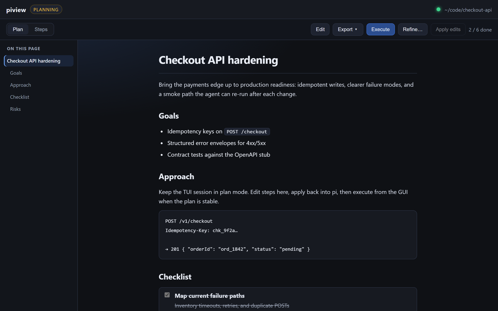
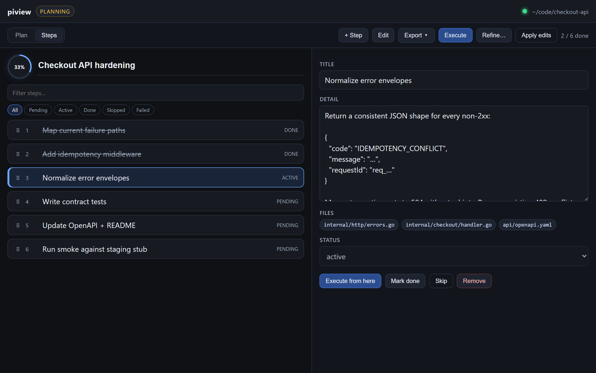
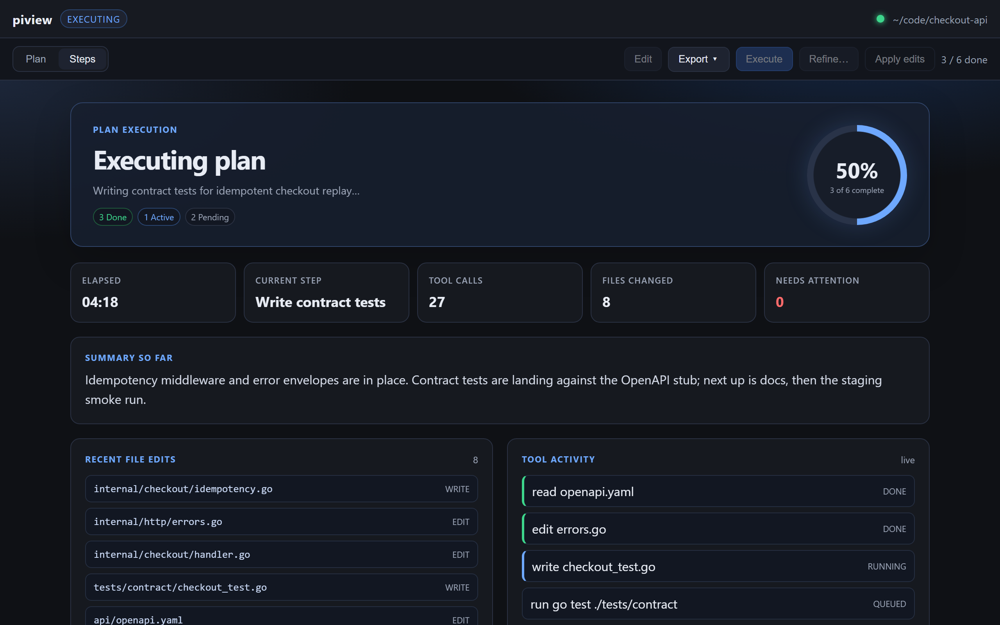

# piview

Plan-mode GUI companion for [pi](https://pi.dev).

Use **pi’s TUI normally**. Run **`/plangui`** to open a long-lived plan viewer window with formatting and editing tools. The same session stays in the terminal.

```
pi TUI  ←→  extension (HTTP UI + WS bridge + plan mode)  ←→  browser (app mode)
```

## Screenshots

Plan document with outline nav, checklist, and progress — mock “Checkout API hardening” session:



Steps editor with status filters, drag reorder, file chips, and step detail:



Live execution dashboard with metrics, file edits, and tool activity:



## Features

- `/plangui` — enable plan mode + open/focus the plan GUI
- `/plan` — toggle plan mode without the GUI
- `/todos` — show plan progress in the TUI
- Structured plan state (not only markdown scraping)
- `update_plan` tool for the model
- Edit steps in the GUI → apply back into pi
- Execute / Refine from the GUI
- TUI status + checklist widget fallback
- Localhost-only HTTP UI + WebSocket bridge with token auth

## Prerequisites

- [pi](https://pi.dev)
- **Node.js** 20+

## Install (pi package)

From git (recommended):

```bash
pi install git:github.com/Knuckles92/piview
# or:
pi install https://github.com/Knuckles92/piview
# pin a release tag when available:
# pi install git:github.com/Knuckles92/piview@v0.1.0
```

`pi install` runs `npm install` for the package. No native toolchain is required — the plan UI is served from the Node extension and opened in your browser.

### Conflict with stock plan-mode

piview is a plan-mode replacement and registers the same `--plan` flag. If you already installed `plan-mode` under `~/.pi/agent/extensions/` (or as another package), either:

- run with `--no-extensions` / `-ne` and load only piview, or
- remove/disable the other plan-mode extension

Otherwise pi fails with `Flag "--plan" conflicts`.

## Quick start (from a clone)

```bash
git clone https://github.com/Knuckles92/piview.git
cd piview
npm install

# Use -ne so stock plan-mode is not also loaded.
pi -ne -e ./extensions/piview
```

Inside pi:

```text
/plangui
```

### CLI flags (extension)

- `--plan` — start in plan mode
- `--plangui` — start in plan mode and open the GUI

### Environment

| Env | Meaning |
|-----|---------|
| `PIVIEW_AUTO=1` | Auto-open GUI on session start |

## Spike (no pi required)

```bash
npm run spike
```

Opens the UI against a fake bridge so you can verify edit/apply/execute messages.

## Protocol

See [`protocol/README.md`](./protocol/README.md) and [`protocol/plan.schema.json`](./protocol/plan.schema.json).

- Extension = HTTP server on `127.0.0.1` (static UI + SSE `/api/*` + WebSocket `/v1`)
- Browser loads the UI over HTTP and streams plan updates via EventSource
- WebSocket remains available for external protocol clients (token required)

## Layout

```text
extensions/piview/   # pi extension (bridge, plan mode, tools, web UI)
  bridge/            # HTTP + WS server, browser opener
  web/               # plan GUI (HTML/CSS/JS)
protocol/            # shared schema
scripts/             # smoke + spike
```

## Security

- Bridge binds `127.0.0.1` only
- Random per-session token required on WS connect
- UI is localhost-only (same trust model as the terminal)

Report security issues via [GitHub Advisories](https://github.com/Knuckles92/piview/security/advisories) on this repository.

## Troubleshooting

### `/plangui` could not open a browser

1. Confirm a browser is installed and available on `PATH`.
2. The notify toast includes the UI URL — open it manually if auto-launch fails.
3. Retry `/plangui`. Plan mode via `/plan` still works in the TUI without the GUI.

### Flag `"--plan" conflicts`

Another extension already registered `--plan`. Use `pi -ne -e …/piview` or disable the other plan-mode package. See [Install](#install-pi-package).

## Development

```bash
npm run check          # TypeScript typecheck
npm test               # bridge protocol + UI smoke test
npm run spike          # fake bridge + open UI
```

## Status

MVP: companion open/edit/execute path works. The plan UI is a local web app opened in an app-mode browser window (Chrome/Chromium when available).

## License

[MIT](./LICENSE)
